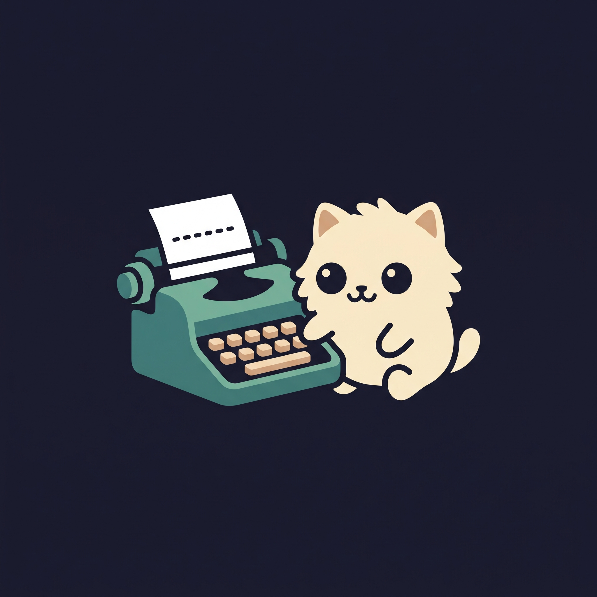

# ClickClack 🐾⌨️

<p align="center">
  
</p>

<p align="center">
  <strong>A cozy, pixel-art desktop companion & Obsidian daily task manager featuring Inky the pet.</strong>
</p>

<p align="center">
  <a href="#-overview">Overview</a> •
  <a href="#-features">Features</a> •
  <a href="#-rtl--persian-support">RTL & Persian Support</a> •
  <a href="#-windows-startup-on-boot">Windows Startup</a> •
  <a href="#-getting-started">Getting Started</a> •
  <a href="#-single-file-publish">Single-File Publish</a> •
  <a href="#-obsidian-integration">Obsidian Integration</a> •
  <a href="#-project-structure--codebase-links">Architecture & Code</a> •
  <a href="#-testing">Testing</a>
</p>

---

## ✨ Overview

**ClickClack** brings charm, focus, and vintage warmth to your desktop daily routine. It sits smoothly on your desktop as an animated mechanical typewriter paired with **Inky**, your pixel-art companion. ClickClack connects directly to your **Obsidian daily notes**, allowing you to view, complete, add, and delete daily checklist tasks right from your desktop in real-time.

ClickClack supports bilingual workflows out of the box with native **Right-to-Left (RTL) and Persian (Farsi) text support** using the embedded **Mikhak** font, alongside effortless **Windows boot startup** so your companion is always ready when you log in.

---

## 🚀 Features

### 🐱 Inky the Companion
- **Expressive Pixel-Art States**: Inky reacts to your actions with fluid animations including `idle`, `idle2`, `curious`, `happy`, `sleep`, and `celebrate`.
- **Interactive Petting**: Click Inky to cheer him up and watch him celebrate!

### ⌨️ Interactive Typewriter & Paper
- **Animated Mechanical Typewriter**: Interacting with tasks triggers animated key-strikes and typewriter platen movement.
- **Roll & Extend Paper**: Roll paper in or out of the carriage.
- **Full Paper Focus Mode**: Click the vintage pen icon on the paper to open the full-size task paper sheet for distraction-free task editing.

### 📝 Direct Obsidian Task Management
- **Two-Way Synchronization**: Automatically monitors your Obsidian vault's daily note with a reactive [`ObsidianService`](PixelCompanion/Services/ObsidianService.cs) and refreshes whenever the file changes.
- **Live Checkbox Toggling**: Checking an item on the paper instantly updates `- [ ]` to `- [x]` in your Obsidian `.md` file (and vice versa).
- **Inline Task Creation**: Click the `+` button below your tasks, type your task title, and press <kbd>Enter</kbd> to append it directly to your note.
- **Task Deletion**: Easily remove tasks directly from the paper using the corner `×` button without leaving your desktop.

### 🪟 Desktop Convenience
- **Always-on-Top Toggle**: Pin ClickClack to float above all windows or keep it in the background.
- **Drag Anywhere**: Click and drag smoothly anywhere across multi-monitor setups.
- **System Tray Integration**: Sits quietly in the Windows notification area with a custom icon and quick-access context menu ([`TrayService.cs`](PixelCompanion/Services/TrayService.cs)).
- **Configurable Settings**: Specify your Obsidian vault location, daily notes subfolder path, and date naming patterns (e.g. `yyyy-MM-dd`) in [`SettingsWindow.xaml`](PixelCompanion/Views/SettingsWindow.xaml).

---

## 🌐 RTL & Persian Support

ClickClack is designed for seamless multilingual use, offering full support for Persian (Farsi) and Right-to-Left (RTL) scripts:

- **Integrated Mikhak Font**: Bundles the [`Mikhak-FD`](PixelCompanion/Assets/Fonts/Mikhak-FD.ttf) variable font as an embedded application resource, featuring native Persian digits (Farsi Digits) and complete Arabic presentation forms.
- **Smart Direction Auto-Detection**: Uses [`TextToFlowDirectionConverter.cs`](PixelCompanion/Converters/TextToFlowDirectionConverter.cs) to inspect tasks and input on-the-fly:
  - **Persian Tasks**: The checkbox indicator flips to the right side, text flows naturally from right to left, and the delete action appears on the left.
  - **English Tasks**: Preserves standard Left-to-Right alignment and layout.
  - **Dynamic Input Box**: When typing in the Tasks Paper, typing Persian immediately switches the input box and cursor to RTL.
- **BiDi Layout Perfection**: Eliminates text jumping, reversed parentheses, and displaced punctuation marks when mixing Persian words, English terms, and numbers.

---

## ⚡ Windows Startup on Boot

ClickClack can launch automatically when Windows boots up and you log in:

- **Zero Admin Rights Required**: Utilizes the current user registry key (`HKCU\Software\Microsoft\Windows\CurrentVersion\Run`), preventing annoying UAC prompts.
- **One-Click Toggles**:
  - **From System Tray**: Right-click the tray icon $\rightarrow$ check **Launch on Windows Startup**.
  - **From Settings**: Open **Settings...** $\rightarrow$ check **Launch ClickClack on Windows startup** $\rightarrow$ **Save Settings**.
- **Auto-Syncing Location**: Handled by [`StartupService.cs`](PixelCompanion/Services/StartupService.cs). If you ever move your compiled `ClickClack.exe` to another folder, simply running it once automatically refreshes the startup registry entry to the new location.
- **Windows Task Manager**: Cleanly appears in the Windows **Task Manager $\rightarrow$ Startup Apps** list.

---

## 🛠️ Tech Stack

- **Runtime & Language**: [.NET 9.0](https://dotnet.microsoft.com/download/dotnet/9.0) (C# 13 / WPF)
- **Architecture**: MVVM (Model-View-ViewModel) pattern
- **Typography**: [Mikhak-FD](PixelCompanion/Assets/Fonts/Mikhak-FD.ttf) embedded OpenType font
- **Rendering**: Hardware-accelerated WPF with custom pixel-perfect scaling (`NearestNeighbor` rendering)
- **File Watching**: Reactive `FileSystemWatcher` with debounced, atomic file writes to protect Obsidian notes
- **Testing**: [MSTest](PixelCompanion.Tests/PixelCompanion.Tests.csproj) test suite covering models, converters, startup registry, Obsidian parsing, and visual rendering

---

## 🏁 Getting Started

### Prerequisites

- Windows 10 / 11 (64-bit)
- [.NET 9.0 SDK](https://dotnet.microsoft.com/download/dotnet/9.0) or later
- [Obsidian](https://obsidian.md/) (with the Daily Notes core plugin enabled)

### Build & Run Locally

1. **Clone the repository**:
   ```bash
   git clone https://github.com/AliBazoubandi/ClickClack.git
   cd ClickClack
   ```

2. **Build the project**:
   ```bash
   dotnet build PixelCompanion/PixelCompanion.csproj -c Release
   ```

3. **Run ClickClack**:
   ```bash
   dotnet run --project PixelCompanion
   ```

---

## 📦 Single-File Publish

You can package ClickClack into a self-contained single `.exe` that runs anywhere without needing the .NET runtime installed:

```powershell
dotnet publish "PixelCompanion/PixelCompanion.csproj" -c Release -r win-x64 --self-contained true /p:PublishSingleFile=true /p:IncludeNativeLibrariesForSelfExtract=true /p:DebugType=None /p:DebugSymbols=false
```

Your compiled executable will be located at:
```text
PixelCompanion/bin/Release/net9.0-windows/win-x64/publish/ClickClack.exe
```

All sprites, typewriter graphics, icons, and the Mikhak font are packed directly inside this single `.exe`.

---

## 📓 Obsidian Integration

ClickClack automatically resolves and reads your daily note based on your settings:

1. Right-click the typewriter or system tray icon and open **Settings...**.
2. Select your **Obsidian Vault Root Folder** (e.g. `E:\obsidian\work`).
3. Set your **Daily Notes Subfolder** (e.g. `Task-Manager` or leave blank for vault root).
4. Set your **Daily Note Date Format** (default: `yyyy-MM-dd`).

### Note Format Example
ClickClack parses standard markdown checklists anywhere in your note:

```markdown
# Today's Focus

- [ ] Inspect typewriter on desktop
- [ ] خرید نان و شیر برای عصرانه
- [x] Review pull request on GitHub
- [ ] ارسال ایمیل گزارش هفتگی
```

Clicking a task on the paper modifies the underlying markdown file with atomic writes, preserving your formatting, indentation, Persian text, and sub-items.

---

## 🧪 Testing

ClickClack includes an automated test suite verifying markdown parsing, registry startup toggles, RTL text direction converters, and UI rendering:

```bash
dotnet test
```

All 23 unit, integration, and rendering tests in [`PixelCompanion.Tests`](PixelCompanion.Tests/) will execute and validate the system components.

---

## 📂 Project Structure & Codebase Links

| Component / Layer | Key Files & Direct Links | Description |
| :--- | :--- | :--- |
| **Views (UI Windows)** | • [`MainWindow.xaml`](PixelCompanion/Views/MainWindow.xaml) / [`.cs`](PixelCompanion/Views/MainWindow.xaml.cs)<br>• [`PaperWindow.xaml`](PixelCompanion/Views/PaperWindow.xaml) / [`.cs`](PixelCompanion/Views/PaperWindow.xaml.cs)<br>• [`SettingsWindow.xaml`](PixelCompanion/Views/SettingsWindow.xaml) / [`.cs`](PixelCompanion/Views/SettingsWindow.xaml.cs) | Typewriter desktop pet widget, standalone tasks paper, and settings window. |
| **ViewModels** | • [`CompanionViewModel.cs`](PixelCompanion/ViewModels/CompanionViewModel.cs)<br>• [`SettingsViewModel.cs`](PixelCompanion/ViewModels/SettingsViewModel.cs)<br>• [`RelayCommand.cs`](PixelCompanion/ViewModels/RelayCommand.cs)<br>• [`ViewModelBase.cs`](PixelCompanion/ViewModels/ViewModelBase.cs) | MVVM presentation logic, task state management, animations, and commands. |
| **Services** | • [`StartupService.cs`](PixelCompanion/Services/StartupService.cs)<br>• [`ObsidianService.cs`](PixelCompanion/Services/ObsidianService.cs)<br>• [`ObsidianTaskParser.cs`](PixelCompanion/Services/ObsidianTaskParser.cs)<br>• [`ConfigService.cs`](PixelCompanion/Services/ConfigService.cs)<br>• [`TrayService.cs`](PixelCompanion/Services/TrayService.cs)<br>• [`DateFormatHelper.cs`](PixelCompanion/Services/DateFormatHelper.cs) | Windows boot startup registry, Obsidian file watching & parsing, app configuration, and system tray. |
| **Converters** | • [`TextToFlowDirectionConverter.cs`](PixelCompanion/Converters/TextToFlowDirectionConverter.cs)<br>• [`InverseBoolToVisibilityConverter.cs`](PixelCompanion/Converters/InverseBoolToVisibilityConverter.cs) | Dynamic RTL/LTR text direction detection and visibility converters. |
| **Models** | • [`AppConfig.cs`](PixelCompanion/Models/AppConfig.cs)<br>• [`ObsidianTask.cs`](PixelCompanion/Models/ObsidianTask.cs) | Configuration schema (positions, startup, vault settings) and task models. |
| **Assets & Typography** | • [`Mikhak-FD.ttf`](PixelCompanion/Assets/Fonts/Mikhak-FD.ttf)<br>• [`app.ico`](PixelCompanion/Assets/Icons/app.ico)<br>• [`icon-simple.jpg`](assets/icon-simple.jpg) | Embedded Persian & Latin Mikhak font, pixel character sheets, and application icons. |
| **Test Suite** | • [`StartupServiceTests.cs`](PixelCompanion.Tests/StartupServiceTests.cs)<br>• [`TextDirectionTests.cs`](PixelCompanion.Tests/TextDirectionTests.cs)<br>• [`ObsidianIntegrationTests.cs`](PixelCompanion.Tests/ObsidianIntegrationTests.cs)<br>• [`VisualRenderTests.cs`](PixelCompanion.Tests/VisualRenderTests.cs) | MSTest test suite verifying all system subsystems. |
| **Solution & Project** | • [`PixelCompanion.csproj`](PixelCompanion/PixelCompanion.csproj)<br>• [`PixelCompanion.slnx`](PixelCompanion.slnx) | Build configuration, resource inclusions, and solution setup. |

---

## 📄 License

This project is licensed under the MIT License - feel free to customize and enjoy your desktop companion!
