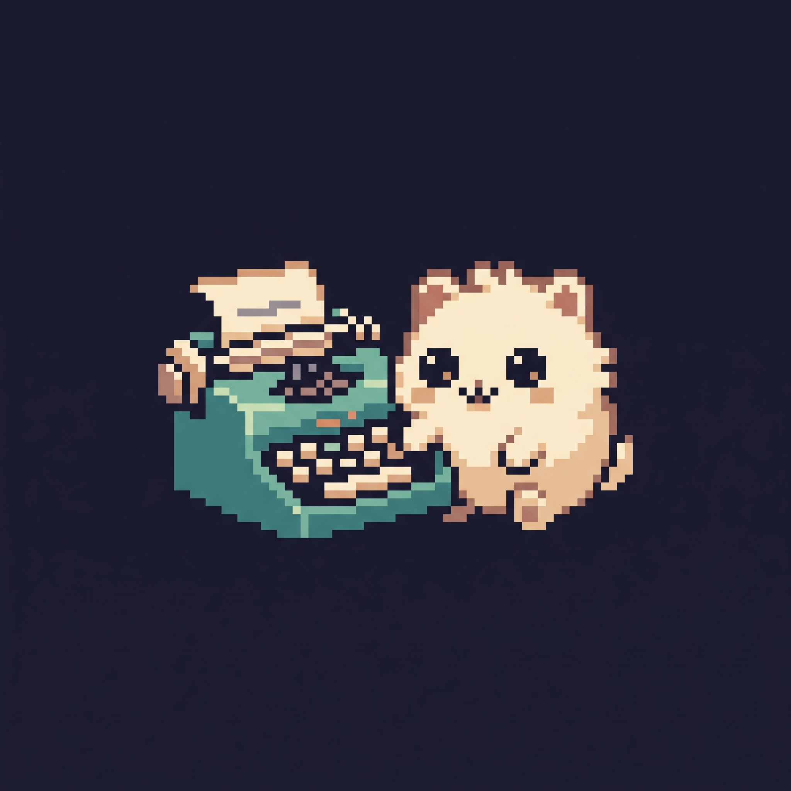

# ClickClack 🐾⌨️

<p align="center">
  
</p>

<p align="center">
  <strong>A cozy, pixel-art desktop companion & Obsidian daily task manager featuring Inky the pet.</strong>
</p>

<p align="center">
  <a href="#features">Features</a> •
  <a href="#getting-started">Getting Started</a> •
  <a href="#how-it-works">How It Works</a> •
  <a href="#obsidian-integration">Obsidian Integration</a> •
  <a href="#architecture">Architecture</a> •
  <a href="#testing">Testing</a>
</p>

---

## ✨ Overview

**ClickClack** brings charm and focus to your daily workflow. It sits peacefully on your desktop as an animated teal typewriter with **Inky**, your pixel-art companion. ClickClack connects directly to your **Obsidian daily notes**, allowing you to view, complete, add, and delete your daily checklist items right from your desktop in real-time.

---

## 🚀 Features

### 🐱 Inky the Companion
- **Delightful Pixel-Art States**: Inky reacts to your actions with expressive animations including `idle`, `idle2`, `curious`, `happy`, `sleep`, and `celebrate`.
- **Interactive Petting**: Click Inky to cheer him up and watch him react.

### ⌨️ Interactive Typewriter & Paper
- **Animated Mechanical Typewriter**: Pressing keys or interacting with tasks triggers realistic key-press and paper movement animations.
- **Roll & Extend Paper**: Roll paper in or out of the typewriter carriage.
- **Full Paper Focus Mode**: Click the vintage pen icon on the paper to open the full-size task paper sheet for distraction-free task management.

### 📝 Direct Obsidian Task Management
- **Two-Way Synchronization**: Automatically monitors your Obsidian vault's daily note and refreshes whenever the file changes.
- **Live Checkbox Toggling**: Checking an item on the paper instantly updates `- [ ]` to `- [x]` in your Obsidian `.md` file (and vice versa).
- **Inline Task Creation**: Click the `+` button below your tasks, type your task title, and press <kbd>Enter</kbd> to append it directly to your note.
- **Task Deletion**: Easily remove tasks directly from the paper using the corner `×` button without leaving your desktop.

### 🪟 Desktop Convenience
- **Always-on-Top Toggle**: Pin ClickClack to float above all windows or keep it in the background.
- **Drag Anywhere**: Click and drag smoothly anywhere across multi-monitor setups.
- **System Tray Integration**: Sits quietly in the Windows system tray with a custom high-res Inky icon and quick-access context menu.
- **Configurable Settings**: Specify your Obsidian vault location, daily notes folder path, and custom date naming patterns (e.g. `YYYY-MM-DD`).

---

## 🛠️ Tech Stack

- **Framework**: .NET 9.0 (C# / WPF)
- **Architecture**: MVVM (Model-View-ViewModel) pattern
- **UI & Graphics**: Hardware-accelerated WPF with custom pixel-perfect scaling (`NearestNeighbor` rendering)
- **File Watching**: Reactive `FileSystemWatcher` with debounced file writes to protect Obsidian notes
- **Testing**: MSTest with unit, integration, and STA rendering test suites

---

## 🏁 Getting Started

### Prerequisites

- Windows 10 / 11 (64-bit)
- [.NET 9.0 SDK](https://dotnet.microsoft.com/download/dotnet/9.0) or later
- [Obsidian](https://obsidian.md/) (with the Daily Notes core plugin enabled)

### Installation & Build

1. **Clone the repository**:
   ```bash
   git clone https://github.com/AliBazoubandi/ClickClack.git
   cd ClickClack
   ```

2. **Restore and build the project**:
   ```bash
   dotnet build PixelCompanion/PixelCompanion.csproj -c Release
   ```

3. **Run ClickClack**:
   ```bash
   dotnet run --project PixelCompanion
   ```
   *The compiled executable will be available at `PixelCompanion/bin/Release/net9.0-windows/ClickClack.exe`.*

---

## 📓 Obsidian Integration

ClickClack automatically resolves and reads your daily note based on your settings:

1. Right-click the system tray icon or open **ClickClack Settings**.
2. Set your **Vault Path** (e.g., `C:\Users\<You>\Documents\MyVault`).
3. Set your **Daily Notes Folder** (e.g., `Daily Notes` or leave blank for vault root).
4. Set your **Date Format** (default: `yyyy-MM-dd`).

### Note Format Example
ClickClack reads markdown checklists anywhere in your note:
```markdown
# Today's Focus

- [ ] Inspect typewriter on desktop
- [ ] Pet Inky
- [x] Write quarterly report
```

Clicking a task on the paper modifies the underlying markdown file with atomic writes, preserving your formatting, indentation, and sub-items.

---

## 🧪 Testing

ClickClack includes an automated test suite verifying markdown parsing, file debouncing, and UI rendering:

```bash
dotnet test
```

All 7 integration and rendering tests will execute and validate the system components.

---

## 📂 Project Structure

```text
ClickClack/
├── assets/                    # Original high-res source artwork & icon files
├── PixelCompanion/            # Main application source code
│   ├── Assets/                # Embedded runtime character, typewriter, and icon sprites
│   ├── Converters/            # WPF UI value converters
│   ├── Models/                # AppConfig & ObsidianTask data models
│   ├── Services/              # ObsidianService, ConfigService, TrayService
│   ├── ViewModels/            # CompanionViewModel, SettingsViewModel
│   ├── Views/                 # MainWindow, PaperWindow, SettingsWindow
│   └── PixelCompanion.csproj  # Configured to build ClickClack.exe with custom icon
├── PixelCompanion.Tests/      # MSTest integration and rendering test suite
└── PixelCompanion.slnx        # Solution file
```

---

## 📄 License

This project is licensed under the MIT License - feel free to customize and enjoy your companion!
